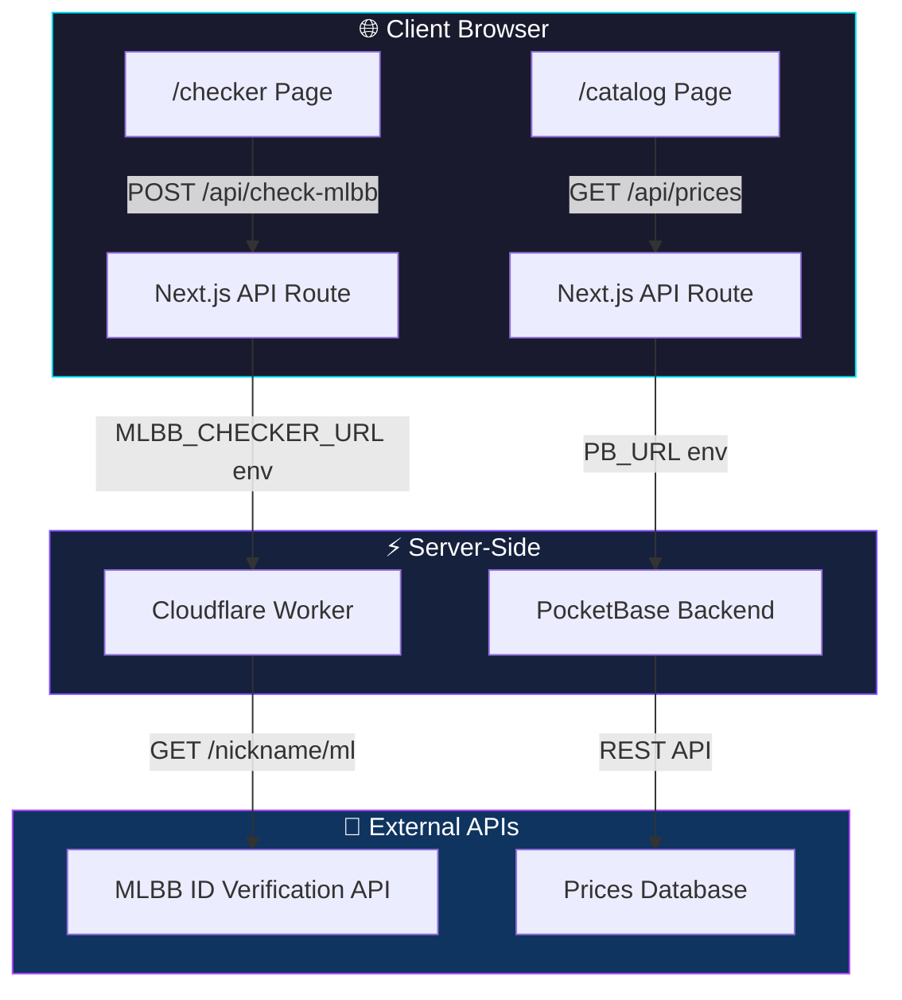
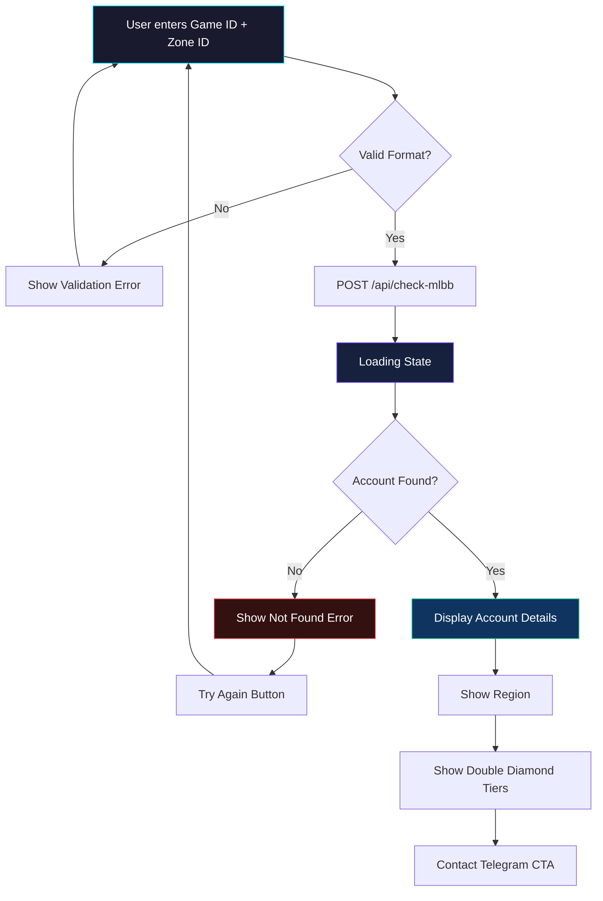

<div align="center">

<!-- Animated gradient banner -->


<!-- Badges -->
[](https://nextjs.org/)
[](https://react.dev/)
[](https://www.typescriptlang.org/)
[](https://tailwindcss.com/)
[](https://workers.cloudflare.com/)
[](https://www.framer.com/motion/)

<br/>

[](LICENSE)
[]()
[]()

</div>

---

## 🎮 Overview

**BINGO Game Top-Up** is a premium game top-up service web application built for the Myanmar market. It features a sleek, dark-themed UI with glassmorphism design, real-time price catalog, and an **MLBB ID verification system** that validates Mobile Legends accounts before purchase.

<div align="center">

| 🏠 Home | 🔍 ID Checker | 💰 Catalog |
|:---:|:---:|:---:|
| Hero landing with animated stats | Verify MLBB accounts instantly | Live prices in MMK |

</div>

---

## ✨ Features

### 🎯 ID Verification System
- **Real-time MLBB Account Lookup** — Verify Game ID + Zone ID via Cloudflare Worker
- **Account Details Display** — Shows IGN (In-Game Name) and Region
- **Double Diamond Tier Check** — Displays availability for `50+50`, `150+150`, `250+250`, `500+500`
- **Error Handling** — Smart retry flow for invalid IDs
- **Secure API Proxy** — Worker URL hidden behind Next.js API routes

### 💎 Price Catalog
- **Multi-Game Support** — Mobile Legends, Magic Chess, PUBG Mobile
- **Live Price Fetching** — Integrated with PocketBase backend
- **Server-Switching** — Toggle between MLBB Global, MY/SG, and other regions
- **Category Filtering** — Diamonds, Weekly Pass, Double Diamond bundles

### 🎨 Design & UX
- **Glassmorphism UI** — Frosted glass cards with subtle borders
- **Framer Motion Animations** — Smooth page transitions and micro-interactions
- **Responsive Layout** — Mobile-first, works on all screen sizes
- **Dark Theme** — Premium `#06060b` base with cyan (`#00e5ff`) and purple (`#b347ff`) accents
- **Custom Typography** — Inter + Space Grotesk font pairing

---

## 🏗️ Architecture



### 📁 Project Structure

```
Portfolio/
├── app/                          # Next.js App Router
│   ├── api/
│   │   ├── check-mlbb/route.ts   # MLBB ID verification proxy
│   │   └── prices/route.ts       # Price catalog proxy
│   ├── checker/page.tsx          # ID Checker UI
│   ├── catalog/page.tsx          # Price catalog UI
│   ├── about/page.tsx            # About page
│   ├── contact/page.tsx          # Contact page
│   ├── page.tsx                  # Homepage
│   └── layout.tsx                # Root layout
├── components/                   # Reusable components
│   ├── Navbar.tsx
│   ├── Footer.tsx
│   ├── GameTabFilter.tsx
│   └── ItemCard.tsx
├── hooks/
│   └── usePrices.ts              # Price fetching hook
├── data/
│   └── types.ts                  # Shared TypeScript types
├── lib/
│   └── utils.ts
├── public/images/                # Static assets
├── next.config.ts
├── open-next.config.ts           # Cloudflare adapter config
└── wrangler.jsonc                # Cloudflare Workers config
```

---

## 🛠️ Tech Stack

| Layer | Technology | Purpose |
|-------|-----------|---------|
| **Framework** | [Next.js 16](https://nextjs.org/) | React framework with App Router |
| **Language** | [TypeScript](https://www.typescriptlang.org/) | Type-safe development |
| **Styling** | [Tailwind CSS v4](https://tailwindcss.com/) | Utility-first CSS |
| **Animations** | [Framer Motion](https://www.framer.com/motion/) | Declarative animations |
| **Deployment** | [Cloudflare Workers](https://workers.cloudflare.com/) | Edge computing platform |
| **Backend** | [PocketBase](https://pocketbase.io/) | SQLite-based backend |
| **ID Check** | Cloudflare Worker | MLBB account verification proxy |

---

## 🚀 Getting Started

### Prerequisites

- [Node.js](https://nodejs.org/) 20+ 
- [npm](https://www.npmjs.com/) or [pnpm](https://pnpm.io/)

### Installation

```bash
# Clone the repository
git clone https://github.com/komenome/portfolio.git
cd portfolio

# Install dependencies
npm install

# Create environment file
cp .env.example .env.local
```

### Environment Variables

| Variable | Required | Description | Example |
|----------|----------|-------------|---------|
| `PB_URL` | ✅ | PocketBase backend URL | `https://your-pb-instance.com` |
| `MLBB_CHECKER_URL` | ✅ | MLBB ID verification worker | `https://your-worker-url.workers.dev` |

> ⚠️ **Note:** Never commit `.env.local` to Git. These values should be configured in your Cloudflare Dashboard for production.

### Development

```bash
# Start the development server with Turbopack
npm run dev
```

Open [http://localhost:3000](http://localhost:3000) to view the app.

### Build & Deploy

```bash
# Local production build
npm run build

# Preview Cloudflare build locally
npm run preview

# Deploy to Cloudflare Workers
npm run deploy
```

---

## 🔐 API Routes

### `POST /api/check-mlbb`

Verifies a Mobile Legends account via Cloudflare Worker proxy.

**Request Body:**
```json
{
  "gameId": "12345678",
  "zoneId": "3001"
}
```

**Response:**
```json
{
  "valid": true,
  "ign": "PlayerName",
  "country": "Malaysia",
  "available_tiers": ["50+50", "150+150"]
}
```

### `GET /api/prices`

Fetches game pricing data from PocketBase.

**Response:**
```json
[
  {
    "gameId": "mlbb-global",
    "gameName": "Mobile Legends",
    "currency": "Diamonds",
    "items": [...],
    "weeklyPass": [...],
    "doubleDiamond": [...]
  }
]
```

---

## 🎨 Design System

### Color Palette

| Token | Hex | Usage |
|-------|-----|-------|
| `--bg-primary` | `#06060b` | Page background |
| `--accent-cyan` | `#00e5ff` | Primary CTAs, highlights |
| `--accent-purple` | `#b347ff` | Secondary accents |
| `--glass-border` | `rgba(255,255,255,0.06)` | Card borders |
| `--glass-bg` | `rgba(255,255,255,0.03)` | Card backgrounds |

### Typography

- **Headings:** Space Grotesk — Bold, modern geometric sans-serif
- **Body:** Inter — Clean, highly readable interface font

---

## 🧪 Checker Flow



---

## 🤝 Contributing

Contributions are welcome! Please follow these steps:

1. Fork the repository
2. Create a feature branch (`git checkout -b feature/amazing-feature`)
3. Commit your changes (`git commit -m 'feat: Add amazing feature'`)
4. Push to the branch (`git push origin feature/amazing-feature`)
5. Open a Pull Request

---

## 📄 License

This project is licensed under the [MIT License](LICENSE).

---

<div align="center">

**Built with ❤️ by BINGO Game Shop**

<a href="https://t.me/KomeNome" target="_blank">
  
</a>

<br/><br/>


</div>
